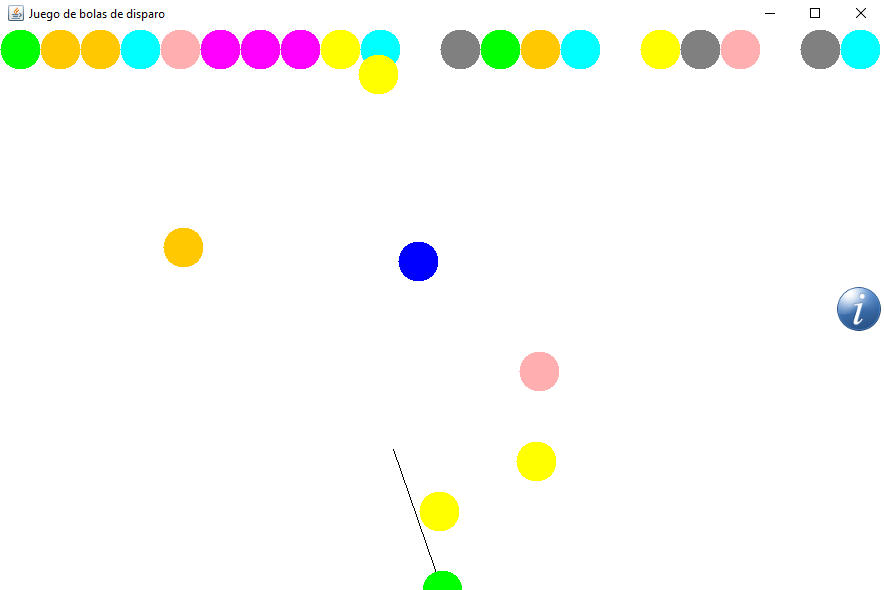

# Game with balls 

**Program**: https://github.com/oscarjcg/ball-game-java/tree/master/Application
* **Windows**: Standalone
* **Linux**: java -jar Aplicacion.jar

**Description:** Shooting game with balls

**Features**:
* Mouse click: Shoot ball
* MVC

**Development environment**:
* **OS**: Linux
* **Java**: 1.8.0_121  
* **Eclipse**: Neon